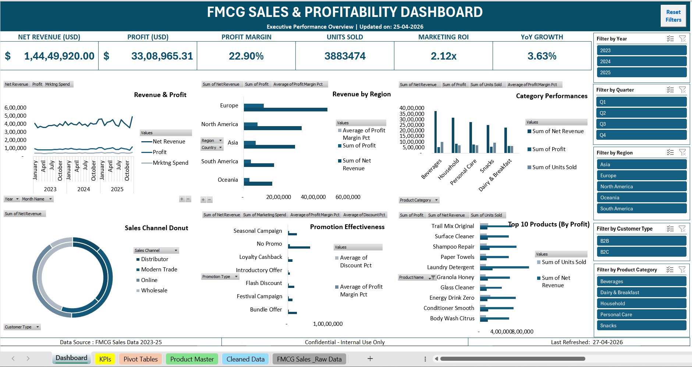

# 📊 FMCG Sales & Profitability Dashboard (2023–2025)

## 📌 Project Overview
An interactive executive dashboard built in Microsoft Excel analyzing 18,000+ 
FMCG transactions across 2023–2025. Designed to provide actionable insights 
on sales performance, profitability, and marketing effectiveness.

## 🔍 Key Features
- **KPI Cards** — Net Revenue, Profit, Margin %, Units Sold, Marketing ROI, YoY Growth
- **Interactive Slicers** — Filter by Year, Quarter, Region, Category
- **6 Charts** — Trend lines, regional bar charts, category combo chart, donut
- **Top 10 Products** — By profit, dynamically filtered
- **Salesperson Leaderboard** — Ranked by revenue and margin
- **Reset All Filters Button** — One-click macro to clear all slicers
- **Conditional Formatting** — Margin heatmap and performance flags

## 🛠️ Tools Used
- Microsoft Excel (Pivot Tables, Pivot Charts, Slicers, Other Functions)
- VBA Macro (Reset button)
- Data: 18,206 records | 27 columns 

## 📁 Files
| File | Description |
|------|-------------|
| `FMCG_Sales_and_Profitability_Dashboard_2023_2025.xlsm` | Main Excel dashboard file |
| `dashboard_preview.png` | Dashboard screenshot |

## 👤 Author
**Niranjan V A** | MIS Executive | Aspiring Data Analyst  
📧 niranjanva1104@gmail.com | 🔗 www.linkedin.com/in/niranjan-v-a-
